# FitTrack ML

[](https://github.com/deepakdeo/fittrack-ml/actions/workflows/ci.yml)
[](https://www.python.org/downloads/)
[](https://pytorch.org/)
[](https://opensource.org/licenses/MIT)
[](https://github.com/astral-sh/ruff)
[]()

End-to-end machine learning pipeline for **Human Activity Recognition (HAR)** from wearable sensor data. Classifies physical activities (walking, running, sitting, etc.) from accelerometer and gyroscope readings, similar to fitness tracking in devices like smart watches.

## Architecture

```mermaid
flowchart LR
    subgraph Data["📊 Data Layer"]
        A[UCI HAR Dataset] --> B[Pandera Validation]
        B --> C[Train/Val/Test Split]
    end

    subgraph Features["⚙️ Feature Engineering"]
        C --> D[Time Domain]
        C --> E[Frequency Domain]
        D --> F[Normalized Features]
        E --> F
    end

    subgraph Models["🤖 Model Training"]
        F --> G[Random Forest]
        F --> H[XGBoost]
        F --> I[LSTM]
        F --> J[1D-CNN]
    end

    subgraph MLOps["📈 MLOps"]
        G & H & I & J --> K[MLflow Tracking]
        K --> L[Model Registry]
        L --> M[A/B Testing]
    end

    subgraph Deploy["🚀 Deployment"]
        M --> N[FastAPI]
        N --> O[Docker]
    end
```



**Pipeline Flow:**
```
Raw Sensor Data → Validation → Preprocessing → Feature Extraction → Model Training → MLflow → FastAPI
```

## Key Features

| Component | Description |
|-----------|-------------|
| **Data Pipeline** | Automated download, validation (Pandera), and preprocessing with train/val/test splits |
| **Feature Engineering** | Time-domain (mean, std, SMA, zero-crossing) and frequency-domain (FFT) features |
| **Classical ML** | Random Forest and XGBoost with hyperparameter tuning via GridSearchCV |
| **Deep Learning** | LSTM and 1D-CNN architectures in PyTorch with early stopping and LR scheduling |
| **MLOps** | MLflow experiment tracking, model registry, and versioning |
| **A/B Testing** | Statistical framework for model comparison (chi-square, confidence intervals) |
| **Deployment** | FastAPI REST endpoint with Docker containerization |
| **Scalability** | Dask integration for parallel processing of large datasets |

## Results

### Model Performance

The Random Forest classifier achieves **97.8% test accuracy** on the UCI HAR dataset:


### Confusion Matrix

Strong performance across all 6 activity classes with minimal confusion:


### Data Exploration

**Class Distribution** - Balanced dataset across activities:


**Feature Distributions** - Clear separation between static (sitting/standing/laying) and dynamic activities:


### Performance Summary

| Model | Test Accuracy | F1-Score (Macro) | Training Time |
|-------|---------------|------------------|---------------|
| **Random Forest** | **97.8%** | **97.9%** | ~2 sec |
| XGBoost | ~96% | ~0.96 | ~5 sec |
| LSTM | ~94% | ~0.94 | ~2 min |
| 1D-CNN | ~95% | ~0.95 | ~2 min |

*Verified on UCI HAR test set (2,947 samples). Results may vary based on random seed and hyperparameter configuration.*

## Quick Start

### Installation

```bash
# Clone the repository
git clone https://github.com/deepakdeo/fittrack-ml.git
cd fittrack-ml

# Create virtual environment
python -m venv .venv
source .venv/bin/activate  # On Windows: .venv\Scripts\activate

# Install dependencies
pip install -e ".[dev]"

# Download the UCI HAR dataset
fittrack-download
```

### Training Models

**Option 1: Jupyter Notebooks (Recommended for exploration)**
```bash
jupyter notebook notebooks/
```
- `01_eda.ipynb` - Exploratory data analysis
- `02_feature_engineering.ipynb` - Feature extraction demo
- `03_classical_ml.ipynb` - Random Forest & XGBoost training
- `04_deep_learning.ipynb` - LSTM & CNN training
- `05_mlops.ipynb` - MLflow tracking demo

**Option 2: Python API**
```python
from fittrack.data import load_har_data, create_train_val_test_split
from fittrack.models import train_random_forest, compute_metrics

# Load data
dataset = load_har_data()
X_train, X_val, X_test, y_train, y_val, y_test = create_train_val_test_split(
    dataset.X, dataset.y
)

# Train model
result = train_random_forest(X_train, y_train)

# Evaluate
metrics = compute_metrics(y_test, result.model.predict(X_test))
print(f"Accuracy: {metrics.accuracy:.2%}")
```

### Running the API

```bash
# Start the FastAPI server
uvicorn fittrack.deployment.api:app --reload

# Test prediction (in another terminal)
curl -X POST http://localhost:8000/predict \
  -H "Content-Type: application/json" \
  -d '{"features": [0.1, 0.2, ...]}'  # 561 features
```

### Docker Deployment

```bash
# Build and run with Docker Compose
docker-compose up --build

# Services:
# - API: http://localhost:8000
# - MLflow UI: http://localhost:5000
```

## Project Structure

```
fittrack-ml/
├── src/fittrack/
│   ├── data/
│   │   ├── download.py          # Dataset downloader
│   │   ├── ingestion.py         # Data loading with Pandera validation
│   │   ├── preprocessing.py     # Normalization, splits, class weights
│   │   └── parallel_processing.py  # Dask scalability demo
│   ├── features/
│   │   └── engineering.py       # Time/frequency domain features
│   ├── models/
│   │   ├── classical.py         # Random Forest, XGBoost
│   │   ├── deep_learning.py     # LSTM, CNN, training loops
│   │   ├── data_loaders.py      # PyTorch Dataset/DataLoader
│   │   └── evaluation.py        # Metrics, confusion matrix, ROC
│   ├── mlops/
│   │   ├── tracking.py          # MLflow experiment tracking
│   │   ├── registry.py          # Model versioning and stages
│   │   └── ab_testing.py        # Statistical A/B testing
│   └── deployment/
│       └── api.py               # FastAPI REST endpoint
├── notebooks/                   # Jupyter notebooks for experiments
├── tests/                       # pytest test suite (139 tests)
├── data/                        # Raw/processed data (gitignored)
├── Dockerfile                   # Container build
├── docker-compose.yml           # Multi-service orchestration
└── pyproject.toml               # Project configuration
```

## Dataset

This project uses the [UCI Human Activity Recognition Dataset](https://archive.ics.uci.edu/ml/datasets/human+activity+recognition+using+smartphones):

- **10,299 samples** from 30 subjects (ages 19-48)
- **6 activity classes**: Walking, Walking Upstairs, Walking Downstairs, Sitting, Standing, Laying
- **561 features** derived from 3-axis accelerometer and gyroscope signals
- **Sampling rate**: 50Hz with sliding windows of 2.56 seconds

## Tech Stack

- **ML/DL**: scikit-learn, XGBoost, PyTorch
- **Data Processing**: Pandas, NumPy, Dask
- **Validation**: Pandera, Pydantic
- **MLOps**: MLflow
- **API**: FastAPI, Uvicorn
- **Testing**: pytest (139 tests, ~53% coverage)
- **Code Quality**: Ruff, mypy, pre-commit hooks
- **CI/CD**: GitHub Actions
- **Containerization**: Docker, Docker Compose

## Development

```bash
# Run tests
pytest

# Run tests with coverage
pytest --cov=src/fittrack --cov-report=html

# Lint and format
ruff check src/ tests/
ruff format src/ tests/

# Type checking
mypy src/
```

## License

MIT License - see [LICENSE](LICENSE) for details.
